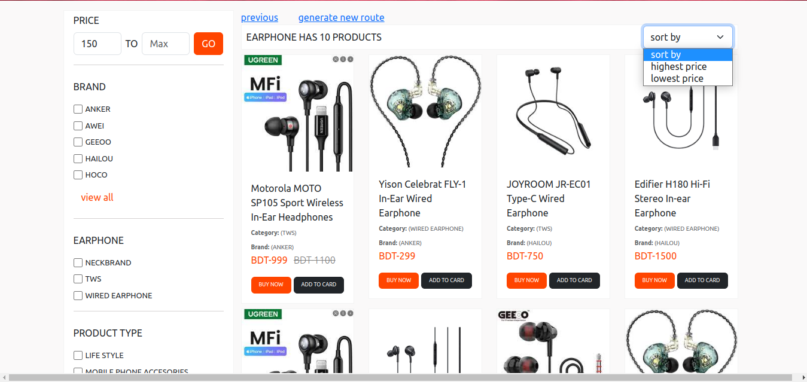
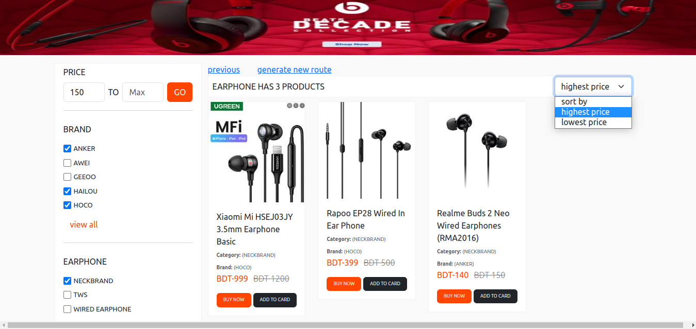
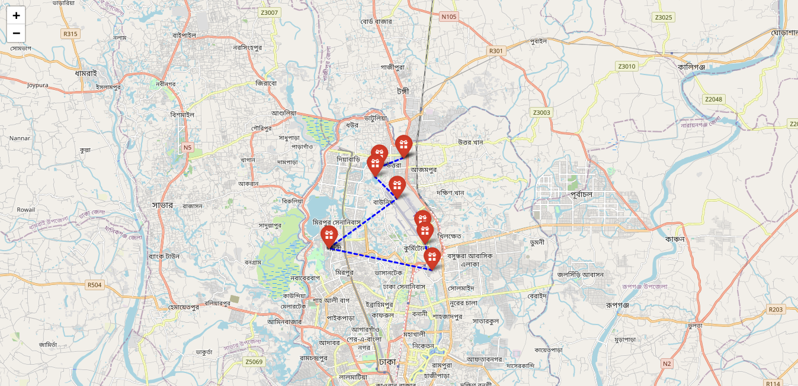

# product-filter
### step 1:
#### requirement:
1. python3
2.     pip install -r requirements.txt
3.     python manage.py runserver

### step2 :
#### output 
1. filter products url
`{domain}/products/`

1. Already generate best route
`{domain}/salesman/best-route/`

2. Generate new best route 
`{domain}/salesman/best-route-generate/`

### Live links
1. <a href="https://mehedihasan.pythonanywhere.com/" target="_blank" style="text-decoration:underline">All products</a> 
2. <a href="https://mehedihasan.pythonanywhere.com/salesman/best-route/" target="_blank" style="text-decoration:underline">Already generated best route</a>
3. <a href="http://mehedihasan.pythonanywhere.com/salesman/best-route-generate/ " target="_blank" style="text-decoration:underline">Generate new Best Route</a>

### Demo 
1. All products

2.Filterd products

3. Best route 

